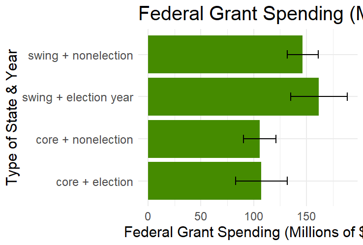
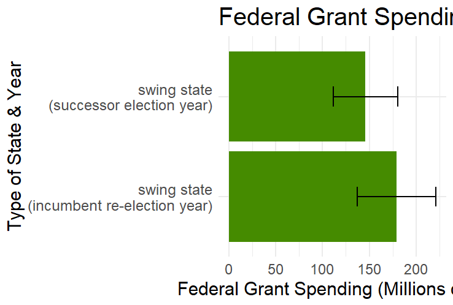

Incumbency can be an important factor in the results of an election. Incumbents may enjoy such advantages as easy name recognition, ability to take credit for the country's usual steady economic growth, and even the ability to allocate more federal funding to certain states. These advantages seem to lead to 7 out of 11 incumbent presidents winning since 1948. However, much of this advantage extends only to incumbent presidents, not to their parties -- when considering all incumbent parties running for re-election, the statistic falls to 9 out of 19 wins since 1948, which chalks it up to a coin flip.

In 2024, we have two unusual cases of incumbency, running against each other. One is the current vice president stepping in last-minute to fill in for the incumbent president; the other is a former president running for a non-contiguous second term. These unique scenarios suggest that the way incumbency was applied in previous models may not be fully applicable to today.

While Harris benefits from some of the automatic name recognition and association with the current work of the Biden administration, she is not the incumbent president. In fact, out of all 15 candidates who worked in previous administrations since 1948, only 6 won (40%); suggesting that being part of a previous administration alone does not give you that same advantage as having actually presided over it.

While Trump benefits from plenty of name recognition and has a previous record in office for voters to reference, he is also not the incumbent president. A non-contiguous presidency has only happened once before (Grover Cleveland - long before the post-1948 time frame), and so there is not enough data on non-contiguous presidencies to arrive at a data-driven conclusion about it. However, 

Although both have advantages, mainly on account of high public profiles, I would not consider either to truly benefit from the full incumbency advantage. After all, neither has the particular incumbent advantage of directing grant spending towards states they need in the election:

These graphs show that incumbent presidents tend to spend much more in this area during election years, and do so more for their own re-election as compared to their successor's.

Incumbency can change many conditions of an election, which lends itself to the question: how can we model incumbency successfully? 

Alan Abramowitz created a model called "Time-for-Change" that is incredibly simple yet extremely accurate. It regresses on three variables - GDP growth, job approval, and candidate incumbency. The 2020 model used only job approval due to the unusual circumstances around COVID and the GDP, but I am sticking with the 2016 model here because as we have seen before, 2020 was a difficult case. 

In these conditions, I am considering neither candidate to be incumbent. I considered proportionately lowering the advantage by dividing the incumbency coefficient by two, but I hypothesized that any small partial incumbency advantage Harris may have would be canceled out by that of Trump, so we should run the election model as we would in a non-incumbent race. 

Running this model results in a popular-vote prediction of 47% for the incumbent party candidate (Harris). This differs considerably from all previous predictions on this page as well as nationwide predictions (such as 538's prediction of 51.6%), and it differs on the lower side. This checks out intuitively because the model mainly looks at Biden's low job approval and provides no (or rather, a canceled-out) incumbent advantage to Harris. It does not consider campaign strategies, debate performance, election-specific polling, or other factors that could be influencing most models to predict a higher number for Harris. A central factor it could also miss is the reasoning for Biden's low job approval. The low number most likely has little to do with the Democratic Party on the whole and more to do with personal perceptions of Joe Biden, such as about his age. These perceptions would not carry over to a new candidate in the same way as would sentiments of general poor performance. Therefore, this model may not be considering all the factors driving this unique election year. On the other hand, perhaps it is correct and the other polls are considering extraneous variables - only time will tell.
