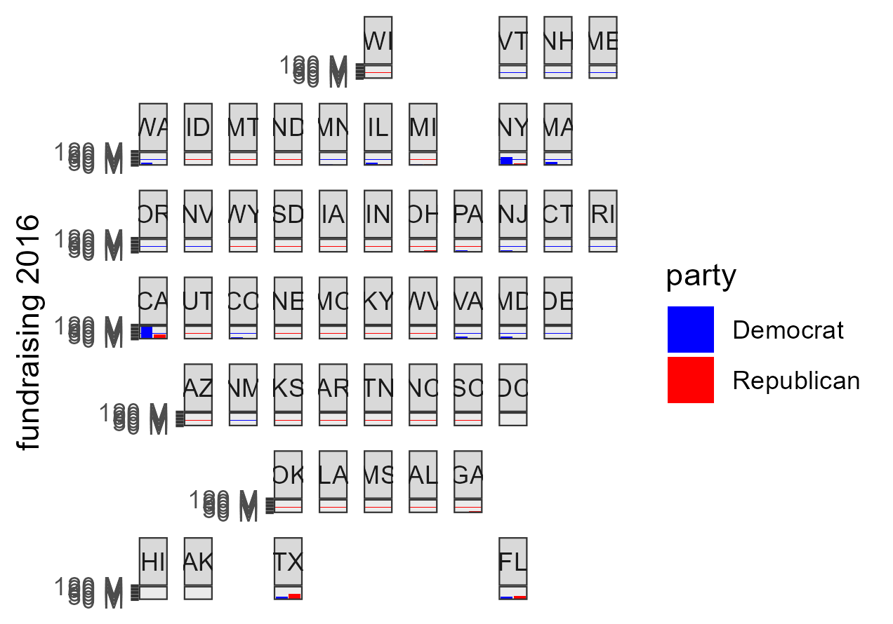
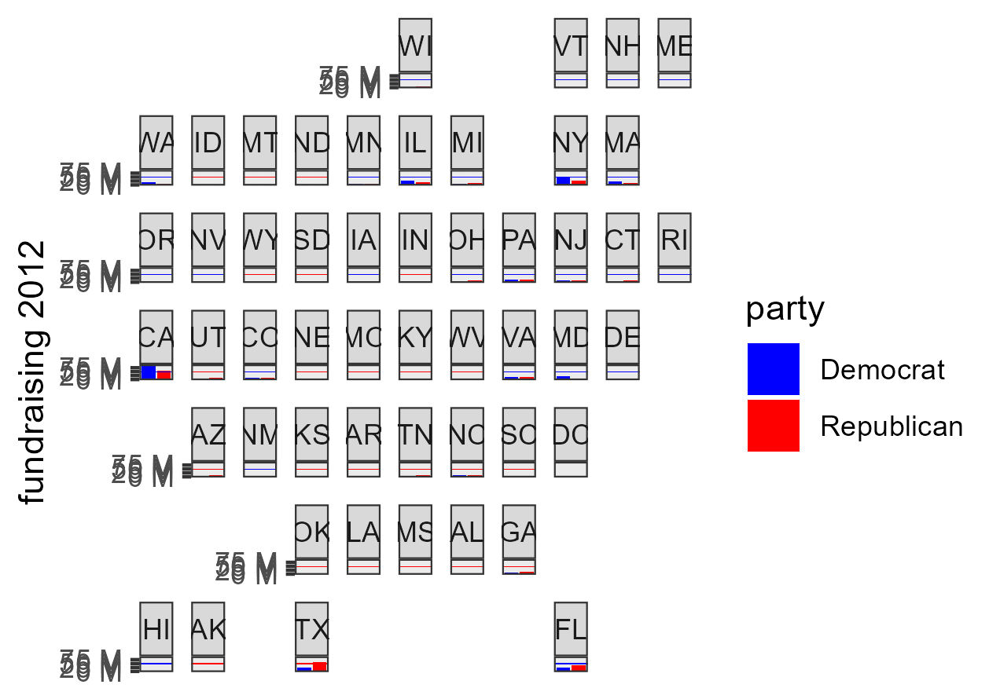
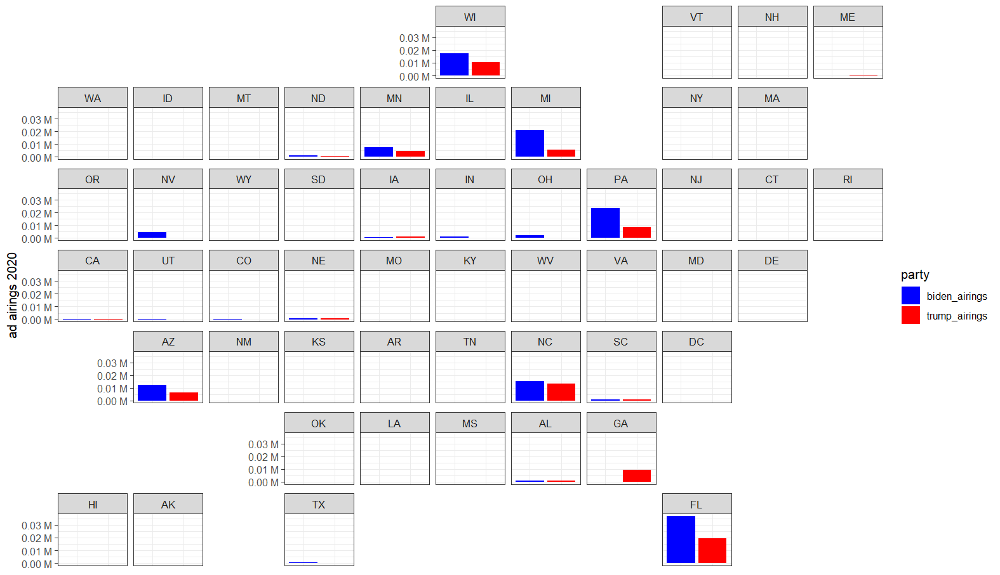
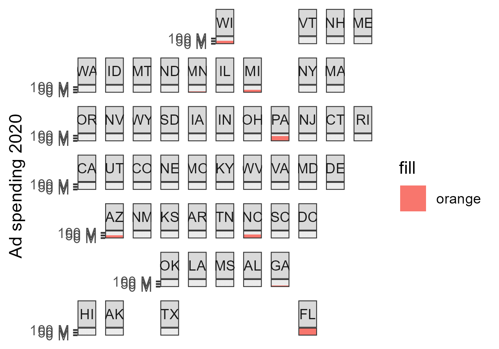

Week 6: The "Air War"

Advertising is a powerful tool to get messages across in many facets of society, but some of the industry’s most groundbreaking cultural moments (see: LBJ's 1964 "Daisy" ad) have been presidential campaigns. Ad spots are perceived as such an effective way of messaging that campaigns regularly spend millions of dollars on them. Today, the “air war” not only focuses on airing television ads, but increasingly features airtime on social media. This election cycle has seen plenty of examples of candidates keeping up with the modernization of marketing, most notably the flurry of memes and cultural interweaving that propelled the Harris campaign in its initial days this July. 

All this advertising is not free; both parties must pay close attention to fundraising to make this aspect of campaigns possible. The more competitive an election, the more important this becomes, as it can turn into something of a rat race to outspend and out-advertise the other party. A key example of this might be Obama and Romney in 2012, as was closely examined in the papers from Week 1.

In the 2020 election, Democrats significantly outfundraised Republicans:

Fundraising TOTALS:
Democrats - $980,912,078
Republicans - $532,525,927

Breaking down the fundraising by state, we can see from where each party collected most of its funds:

The below graphs represent the breakdown of fundraising by state in some other presidential elections. 

In terms of actual ad spending, the dataset we used for 2020 lacks an actual spending breakdown by party. However, it does include airings by party and total ad spending by state.

This first graph suggests that both parties generally try to "match" the other's ad spending by state. Large differentials in the same state are somewhat rare; instead, each state appears like something of a head-to-head ad showdown between the two parties.

Understandably, ad spending is considerably higher in those states considered "swing" states. There is a noticeable markup in ad spending in states considered “swing” as compared to strongholds of either party, even appearing somewhat irrespective of the size of each state. This checks out as the electoral college incentivizes candidates to focus their efforts in a handful of deciding states. 

2020 also saw a major shift in the type of advertising used. Although a significant advertising budget was still directed towards television spots, social media advertising spending increased drastically. 

In 2024, social media spending has been very uneven between the two parties. The Harris campaign has invested heavily in social media channels, spending \$77 million, while the Trump campaign has used it much more sparingly (using only \$9 million of funds for the purpose). 

This suggests that perhaps the benefits of social media include targeting younger voters, among whom the Harris campaign leads in most polling and therefore is trying to drive turnout.

Creating a prediction based on this information can be difficult, as we currently lack final ad spending information. However, I was able to improve on last week's electoral prediction by observing that each swing state was covered among the 19 states for which we had poll data. If we assume all the non-swing states perform as expected, we only have to predict the results of these seven toss-up states (Michigan, Wisconsin, Pennsylvania, North Carolina, Arizona, Nevada, and Georgia). Using a simple ordinary least-squares based on state poll averages and previous results, the model actually finds that Harris wins all seven states, resulting in 319 electoral votes for Democrats and 219 for Republicans. 

I think last week's popular vote prediction was somewhat reasonable and am sticking with it for the moment as it incorporates all the variables I would want to look at. 

